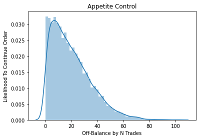

# Iridium Trading Hive

## Executive Summary

* Iridium trading algorithms acheive consistently strong results across diference currencies, like a 20% incremental alpha over holdout.

* Appetite control algorithm significantly reduces risks from market volatility and cashflow issues.

* By grouping many bots together into a Hive network we can diversify and smooth performance over time.


#### Bitcoin Trading Bot Strategy Over Time


Orange for buying decision, blue for sell decision


```python
network.simSummary()
```

    CASHFLOW
    --------------------------------------
    Cash spent (Total Buy Cost): $59224.45
    Cash earned (Total Sell Revenue): $50319.15
    Net Cashflow: -8905.3
    --------------------------------------
    
    ASSET VALUES: 
    --------------------------------------
    Starting Asset Value: $8826.03
    Ending Assets Value: $31755.17
    Net Asset Value: $22929.13
    --------------------------------------
    
    TEST RETURNS
    --------------------------------------
    PNL: $14023.83
    Return %: 158.89%
    --------------------------------------
    
    TEST VS HOLDOUT
    --------------------------------------
    PNL over Hold: $4135.55
    Algo Return over Hold%: 46.86%
    --------------------------------------


## Data

### Currency Index & Price


```python
from coin_hist_pull import *

index = import_coin_list()
index.head()
```


<div>
<table border="1" class="dataframe">
  <thead>
    <tr style="text-align: right;">
      <th></th>
      <th>id</th>
      <th>symbol</th>
      <th>name</th>
    </tr>
  </thead>
  <tbody>
    <tr>
      <th>0</th>
      <td>bitcoin</td>
      <td>BTC</td>
      <td>Bitcoin</td>
    </tr>
    <tr>
      <th>1</th>
      <td>ethereum</td>
      <td>ETH</td>
      <td>Ethereum</td>
    </tr>
    <tr>
      <th>2</th>
      <td>cardano</td>
      <td>ADA</td>
      <td>Cardano</td>
    </tr>
    <tr>
      <th>3</th>
      <td>binancecoin</td>
      <td>BNB</td>
      <td>Binance Coin</td>
    </tr>
    <tr>
      <th>4</th>
      <td>tether</td>
      <td>USDT</td>
      <td>Tether</td>
    </tr>
  </tbody>
</table>
</div>


```python
prices = coin_price_hist('bitcoin', 'usd', 85, 'hourly')
prices.head()
```


<div>
<table border="1" class="dataframe">
  <thead>
    <tr style="text-align: right;">
      <th></th>
      <th>market_tms</th>
      <th>price</th>
      <th>mkt_cap</th>
      <th>total_volumes</th>
    </tr>
  </thead>
  <tbody>
    <tr>
      <th>2042</th>
      <td>2021-08-30 00:44:00.000</td>
      <td>48651.050669</td>
      <td>9.148669e+11</td>
      <td>9.148669e+11</td>
    </tr>
    <tr>
      <th>2041</th>
      <td>2021-08-30 00:01:07.512</td>
      <td>48907.270731</td>
      <td>9.195154e+11</td>
      <td>9.195154e+11</td>
    </tr>
    <tr>
      <th>2040</th>
      <td>2021-08-29 23:01:53.326</td>
      <td>49074.768948</td>
      <td>9.249108e+11</td>
      <td>9.249108e+11</td>
    </tr>
    <tr>
      <th>2039</th>
      <td>2021-08-29 22:01:29.143</td>
      <td>48832.243576</td>
      <td>9.181020e+11</td>
      <td>9.181020e+11</td>
    </tr>
    <tr>
      <th>2038</th>
      <td>2021-08-29 21:00:58.123</td>
      <td>48940.611916</td>
      <td>9.194238e+11</td>
      <td>9.194238e+11</td>
    </tr>
  </tbody>
</table>
</div>


### Google Trends


```python
from g_trends import *
btc_searches = g_trend_pull(['bitcoin'])
btc_searches.head()
```


<div>
<table border="1" class="dataframe">
  <thead>
    <tr style="text-align: right;">
      <th></th>
      <th>bitcoin</th>
      <th>isPartial</th>
    </tr>
    <tr>
      <th>date</th>
      <th></th>
      <th></th>
    </tr>
  </thead>
  <tbody>
    <tr>
      <th>2021-05-30</th>
      <td>72</td>
      <td>False</td>
    </tr>
    <tr>
      <th>2021-05-31</th>
      <td>70</td>
      <td>False</td>
    </tr>
    <tr>
      <th>2021-06-01</th>
      <td>68</td>
      <td>False</td>
    </tr>
    <tr>
      <th>2021-06-02</th>
      <td>67</td>
      <td>False</td>
    </tr>
    <tr>
      <th>2021-06-03</th>
      <td>67</td>
      <td>False</td>
    </tr>
  </tbody>
</table>
</div>


## Methodology

### Individual Bot Strategy

A trading bot is defined by the two currencies it's going to trade. A BTC/USD bot will be a bot that will buy BTC in USD based on the prices of BTC. This means the bot can also trade USD/BTC. Let's init a bot that starts with 10,000 USD worth of Bitcoin and trades ~250 USD at a time.


```python
from Trader import *
inv_amt = 10000
pct = 0.025
bot = Trader('Iridium | BTC/USD', 'bitcoin', 'usd', 'CoinBasePro')
unit_cost = bot.hist['price'].iloc[42*24]
order_amount = inv_amt/unit_cost
bot.learn_and_sim(42*24)
```

#### Trading Strategy

Every hour, the bot looks at the previous 42 days and identifies what the best opportunities to buy and sell would have been. This will set up the training data for the machine learning algorithm later.

Specifically, there are two labels that the bot learns for:

* Buy Ind: If the price change increases by more than 1 standard deviation over the next 48 hours
* Sell Ind: If the price change decreases by more than 1 standard deviation over the next 48 hours

The features can be simplified to:
* Prices and moving averages of prices (momentum)
* Google Trends data (how much public interest is in a currency)

The training data will be the last 42 days minus the current hour, and then split on a 75/25 size. The current hour's data will then be run through the model build and it will return a decision: buy, sell, or do nothing.

#### Hedging Risk with 'Appetite Control'

In early simulations, the bot was exceptionally profitable. It was very good at predicting price rises and subsequently putting in buy orders. However, after a three-week bull run, the bot would be extremely over-leveraged since it had been frantically buying as much as possible. Eventually, a market crash occurred, and the bot's performance went from ~ +80% to -30% in a day.  

To illustrate, you have 100,000 USD and 1 Bitcoin. After 3 weeks of price continuing to go up, you now have $0 and 3 Bitcoin. On paper, that's pretty good - you might have doubled your total asset value. But next week, the price of Bitcoin goes down 50 percent. You still have 3 Bitcoin, but now you have less value overall from when you started.

The way we fix this aggression is to create an 'appetite curve' to make sure the initial balance of currencies remains roughly the same. The more the bot buys, the less likely it is to buy more. The inverse is also true.

To illustrate:


```python
import numpy as np
import seaborn as sns
import warnings
warnings.filterwarnings('ignore')
control = np.random.normal(0, 25, 10000)
control = abs(control)
sns.distplot(control).set(title ="Appetite Control", xlabel="Off-Balance by N Trades", ylabel = "Likelihood To Continue Order")
```


    [Text(0.5, 1.0, 'Appetite Control'),
     Text(0.5, 0, 'Off-Balance by N Trades'),
     Text(0, 0.5, 'Likelihood To Continue Order')]


    

    


So when the bot continues to be aggressively buying or selling, the actual amount it is allowed to trade is restricted until the balance sheet is in equilibrium.

#### Results From Individual Trader

After a couple weeks of trading, the bot's performance in terms of PNL is usually profitable (depending on the currency). Most of the value comes from increased asset size while maintaining a small deficit in cashflow.

Using the example from before, if the bot starts with 100,000 USD and 1 Bitcoin, the ending balance sheet might look like 87,000 USD and 4 Bitcoin. So in essence, you would have bought 3 Bitcoin for 13,000 USD, which is a pretty great deal.

Below, is a the simulation result from a BTC/USD trading bot.


```python
bot.hist_to_pnl(order_amount, order_amount*pct)
bot.summary()
```

    CASHFLOW
    --------------------------------------
    Cash spent (Total Buy Cost): $53409.17
    Cash earned (Total Sell Revenue): $42155.48
    Net Cashflow: -11253.69
    --------------------------------------
    
    ASSET VALUES: 
    --------------------------------------
    Start Quantity: 0.305 BTC
    Starting Asset Value: $9127.85
    Ending Quantity: 0.593 BTC
    Ending Assets Value: $28839.46
    Net Asset Value: $19711.61
    --------------------------------------
    
    TEST RETURNS
    --------------------------------------
    PNL: $8457.92
    Return %: 91.66%
    --------------------------------------
    
    TEST VS HOLDOUT
    --------------------------------------
    PNL over Hold: $2361.29
    Algo Return over Hold%: 15.51%
    --------------------------------------


What this readout shows is that the BTC/USD bot was able to accumulate around 17,000 USD worth of BTC by making some smart trades and only spending a net of 9,300 USD. The bot, on paper, was able to double its asset value by adding 8,500 USD in value.

However, this would not be a true performance readout. It is important to note that during this time period, the price of BTC/USD did increase quite drastically. We need to able to compare the performance of the strategy vs the holdout (i.e if we didn't do anything).

In conclusion, the algorithm was able to create ~ 2,000 USD in net value, an incremental improvement rate of about 20%.

### Hive Network


#### Three's a Party
As we mentioned before, the bots usually have a pretty good performance, but in some cases they are quite bad and are designed to focus on one market at time. We could have multiple bots trading in different markets, but there is a lot more value in storing them in a network. This accomplishes two important goals:

* Many bots trading differnt markets allows us to diversify investments. If one bot fails spectacularly it won't affect the overall performance.

* By putting all the bots in a network, we open up future opportunities to simulate collaboration between bots and improve computing performance.

We're going to take a sample of the top 10 coins in terms of market cap and we're going to create a network of bots to simulate orders. The simulation process takes a long time, but in production it won't be a problem since we are running only one record (the current hour) through the model and processing any orders that need to go through.

We will give each bot around 1,000 USD and a standard trade size of 2.5%, or 25 USD.


```python
from Hive import *
index['err'] = index['id'].apply(lambda x: 1 if '-' in x else 0)
index = index[index['err']==0]
```


```python
network = HiveNet()
network.loadBotNet(index.iloc[0:10]) 
network.setWindow(42)
```


```python
network.learn_performance(42, 1000, 0.025)
network.networkToPerf()
```

#### Results
Now that we have run the network simulation, we can aggregate the performance across all bots in the network and view their results.


```python
network.simSummary()
```

    CASHFLOW
    --------------------------------------
    Cash spent (Total Buy Cost): $59224.45
    Cash earned (Total Sell Revenue): $50319.15
    Net Cashflow: -8905.3
    --------------------------------------
    
    ASSET VALUES: 
    --------------------------------------
    Starting Asset Value: $8826.03
    Ending Assets Value: $31755.17
    Net Asset Value: $22929.13
    --------------------------------------
    
    TEST RETURNS
    --------------------------------------
    PNL: $14023.83
    Return %: 158.89%
    --------------------------------------
    
    TEST VS HOLDOUT
    --------------------------------------
    PNL over Hold: $4135.55
    Algo Return over Hold%: 46.86%
    --------------------------------------


## Internal Collaboration (Next Steps)

While the trading algorithm is extremely effective on its own, it would be interesting to see if there are opportunities for collaborations between bots. Using a tool like `networkx` could help create links between bots.

One potential implementation would be to use an order correlation matrix to create links between bots. It would be interesting to see if some bots have high correlations of orders with each other. If that would be the case, we could save a lot of completxity by having only a few bots make decisions and others following.
