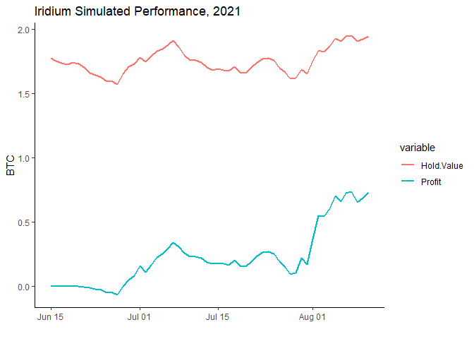

# Iridium-Crypto-Trader
An cryptocurrency trading bot that uses automated machine learning for decision making to maximize returns.

##Algorithmic Trading in Crypto Markets
================
Alessandro Joabar
8/8/2021

# Summary

-   The bot achieves a yield of 37.95% over 481 trades in the ETH-BTC
    market over a 60 day window.

-   It uses a Logistic Regression over the previous 28 days by
    attempting to predict the overall price change over the next 48
    hours.

-   Google trends helps predicting power by understanding the amount of
    ‘hype’ that usually can push a bull run.

-   Due to exceptional returns in the simulations, we will launch the
    bot on a CoinBase sandbox account to validate the model build.

<!-- -->

## Performance

#### Before

| Date       | ETH | Value.In.BTC | BTC | Profit.In.BTC |
|:-----------|----:|-------------:|----:|--------------:|
| 2021-06-15 |  28 |     1.774333 |   0 |             0 |

#### After

| Date       |      ETH | Value.In.BTC |       BTC | Profit.In.BTC |
|:-----------|---------:|-------------:|----------:|--------------:|
| 2021-08-11 | 81.93228 |     5.701425 | -3.019983 |     0.7330047 |

## Appendix

### Simulated Balances

| Date       |      ETH | Value.In.BTC |        BTC | Profit.In.BTC |
|:-----------|---------:|-------------:|-----------:|--------------:|
| 2021-08-11 | 81.93228 |     5.701425 | -3.0199833 |     0.7330047 |
| 2021-08-10 | 81.93228 |     5.627821 | -3.0199833 |     0.6845545 |
| 2021-08-09 | 82.25772 |     5.600022 | -3.0422644 |     0.6515209 |
| 2021-08-08 | 82.58317 |     5.748759 | -3.0645456 |     0.7350841 |
| 2021-08-07 | 82.58317 |     5.733738 | -3.0645456 |     0.7251559 |
| 2021-08-06 | 82.58317 |     5.629896 | -3.0645456 |     0.6565219 |
| 2021-08-05 | 76.05371 |     5.248634 | -2.6138831 |     0.7029030 |
| 2021-08-04 | 70.33795 |     4.688387 | -2.2195077 |     0.6022641 |
| 2021-08-03 | 78.31992 |     5.109645 | -2.7414686 |     0.5415923 |
| 2021-08-02 | 88.22335 |     5.776771 | -3.3920210 |     0.5505278 |
| 2021-08-01 | 89.10134 |     5.573509 | -3.4574579 |     0.3651599 |
| 2021-07-31 | 82.16022 |     4.860742 | -3.0353858 |     0.1691393 |
| 2021-07-30 | 78.56137 |     4.730407 | -2.8234161 |     0.2210300 |
| 2021-07-29 | 73.90430 |     4.277293 | -2.5525446 |     0.1046103 |
| 2021-07-28 | 64.13935 |     3.699963 | -1.9899765 |     0.0945947 |
| 2021-07-27 | 60.15992 |     3.573523 | -1.7608919 |     0.1494198 |
| 2021-07-26 | 59.03219 |     3.583457 | -1.6921400 |     0.1913499 |
| 2021-07-25 | 55.62322 |     3.493411 | -1.4843995 |     0.2504743 |
| 2021-07-24 | 55.62322 |     3.529339 | -1.4843995 |     0.2683163 |
| 2021-07-23 | 55.86767 |     3.532501 | -1.4997695 |     0.2622993 |
| 2021-07-22 | 55.90259 |     3.476452 | -1.5019652 |     0.2332321 |
| 2021-07-21 | 55.90259 |     3.397985 | -1.5019652 |     0.1940671 |
| 2021-07-20 | 55.90259 |     3.314497 | -1.5019652 |     0.1523957 |
| 2021-07-19 | 55.90259 |     3.327118 | -1.5019652 |     0.1586949 |
| 2021-07-18 | 54.46242 |     3.324984 | -1.4156422 |     0.1998788 |
| 2021-07-17 | 54.39958 |     3.252448 | -1.4118724 |     0.1665084 |
| 2021-07-16 | 52.96347 |     3.182831 | -1.3259054 |     0.1741473 |
| 2021-07-15 | 49.55861 |     2.998039 | -1.1210112 |     0.1832084 |
| 2021-07-14 | 48.10285 |     2.885395 | -1.0332735 |     0.1725730 |
| 2021-07-13 | 48.10285 |     2.923551 | -1.0332735 |     0.1885191 |
| 2021-07-12 | 48.10285 |     2.998016 | -1.0332735 |     0.2196388 |
| 2021-07-11 | 48.10285 |     3.025104 | -1.0332735 |     0.2309593 |
| 2021-07-10 | 48.10285 |     3.026371 | -1.0332735 |     0.2314889 |
| 2021-07-09 | 48.10285 |     3.084770 | -1.0332735 |     0.2558948 |
| 2021-07-08 | 48.75667 |     3.246161 | -1.0773252 |     0.3052186 |
| 2021-07-07 | 56.78776 |     3.876839 | -1.6243378 |     0.3408791 |
| 2021-07-06 | 66.54244 |     4.466156 | -2.2878410 |     0.2982508 |
| 2021-07-05 | 69.29946 |     4.571208 | -2.4734411 |     0.2508157 |
| 2021-07-04 | 69.48967 |     4.540816 | -2.4859772 |     0.2251731 |
| 2021-07-03 | 69.48967 |     4.442631 | -2.4859772 |     0.1665506 |
| 2021-07-02 | 69.48967 |     4.343795 | -2.4859772 |     0.1075396 |
| 2021-07-01 | 69.35694 |     4.416377 | -2.4775417 |     0.1558816 |
| 2021-06-30 | 67.64027 |     4.181603 | -2.3714472 |     0.0798129 |
| 2021-06-29 | 60.19597 |     3.676715 | -1.9176594 |     0.0489013 |
| 2021-06-28 | 51.71079 |     3.056338 | -1.4041195 |    -0.0006448 |
| 2021-06-27 | 45.18348 |     2.534922 | -1.0291190 |    -0.0650814 |
| 2021-06-26 | 44.84815 |     2.549372 | -1.0104763 |    -0.0527510 |
| 2021-06-25 | 44.84815 |     2.550626 | -1.0104763 |    -0.0522800 |
| 2021-06-24 | 44.84815 |     2.607561 | -1.0104763 |    -0.0308913 |
| 2021-06-23 | 44.84815 |     2.634501 | -1.0104763 |    -0.0207705 |
| 2021-06-22 | 40.22536 |     2.384336 | -0.7382190 |    -0.0144794 |
| 2021-06-21 | 31.89176 |     1.940820 | -0.2388305 |    -0.0041956 |
| 2021-06-20 | 28.00000 |     1.730763 |  0.0000000 |     0.0000000 |
| 2021-06-19 | 28.00000 |     1.743785 |  0.0000000 |     0.0000000 |
| 2021-06-18 | 28.00000 |     1.726512 |  0.0000000 |     0.0000000 |
| 2021-06-17 | 28.00000 |     1.737508 |  0.0000000 |     0.0000000 |
| 2021-06-16 | 28.00000 |     1.755601 |  0.0000000 |     0.0000000 |
| 2021-06-15 | 28.00000 |     1.774333 |  0.0000000 |     0.0000000 |

